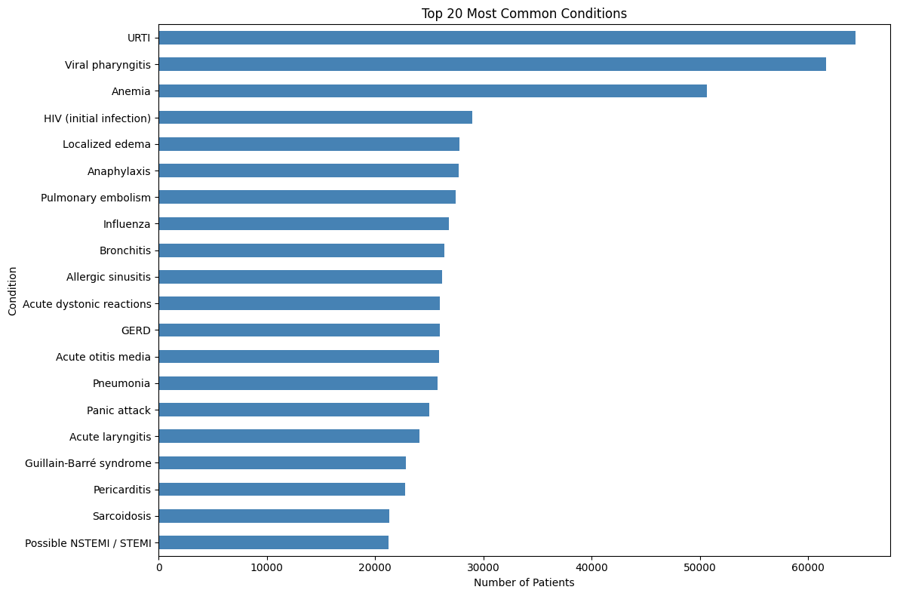
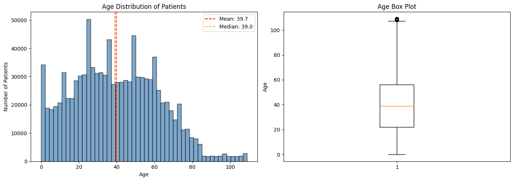
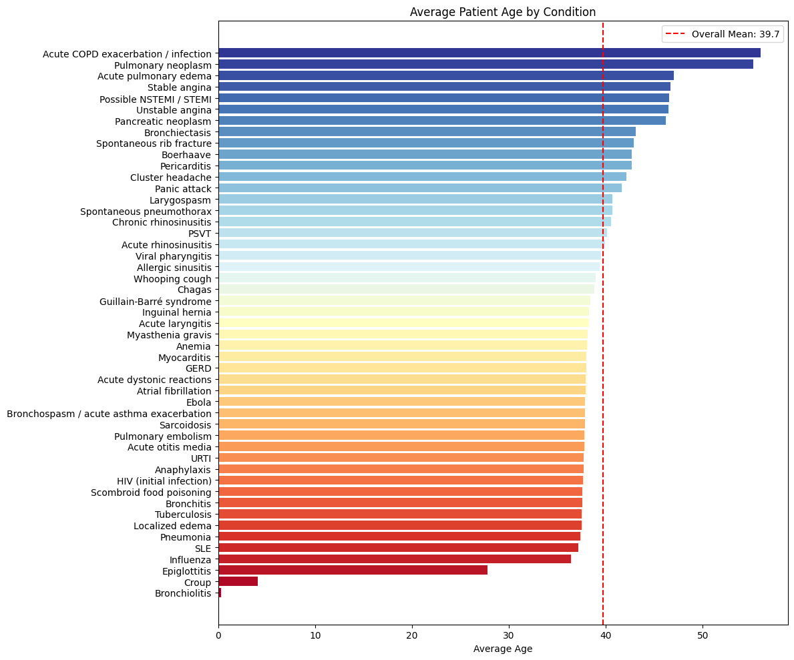

# Healthcare Symptom Checker - AI-Powered Medical Condition Classifier

An end-to-end machine learning project that predicts potential medical conditions based on patient symptoms. Built using PubMedBERT fine-tuned on the DDXPlus medical dataset with **98.22% accuracy** across 49 medical conditions.


---

## Table of Contents

- [Overview](#overview)
- [Key Results](#key-results)
- [Dataset](#dataset)
- [Project Structure](#project-structure)
- [Installation](#installation)
- [Usage](#usage)
- [Model Architecture](#model-architecture)
- [Training Details](#training-details)
- [Exploratory Data Analysis](#exploratory-data-analysis)
- [Technologies Used](#technologies-used)
- [Future Work](#future-work)
- [License](#license)

---

## Overview

This project aims to assist in preliminary medical condition assessment by analyzing patient symptoms. The system uses a fine-tuned transformer model to classify symptoms into one of 49 medical conditions, providing healthcare professionals and patients with potential diagnoses for further investigation.

**Disclaimer:** This tool is for educational and informational purposes only. It is not a substitute for professional medical advice, diagnosis, or treatment.

### Features

- Fine-tuned PubMedBERT model for medical text understanding
- Multi-class classification across 49 medical conditions
- Comprehensive EDA with visualizations
- Production-ready model saved in HuggingFace format
- Detailed training metrics and analysis

---

## Key Results

| Metric | Value |
|--------|-------|
| **Test Accuracy** | 98.22% |
| **F1 Score (Macro)** | 97.94% |
| **F1 Score (Weighted)** | 98.10% |
| **Training Time** | 13 hours 21 minutes |
| **Dataset Size** | 1,292,579 patient records |

### Training Progress

| Epoch | Training Loss | Validation Loss | Accuracy | F1 Macro | F1 Weighted |
|-------|---------------|-----------------|----------|----------|-------------|
| 1 | 0.0449 | 0.0465 | 97.98% | 97.70% | 97.84% |
| 2 | 0.0446 | 0.0456 | 98.02% | 97.78% | 97.88% |
| 3 | 0.0420 | 0.0451 | 98.04% | 97.80% | 97.90% |

---

## Dataset

This project uses the **DDXPlus Dataset**, a large-scale medical diagnosis dataset containing synthetic but realistic patient data.

| Split | Records |
|-------|---------|
| Training | 1,025,602 |
| Validation | 132,448 |
| Test | 134,529 |
| **Total** | **1,292,579** |

### Dataset Characteristics

- **49 Medical Conditions** including respiratory, cardiovascular, neurological, and infectious diseases
- **223 Unique Symptoms** covering various body systems
- **Balanced Demographics:** 51.5% Female, 48.5% Male
- **Age Range:** 0-109 years (Mean: 39.7 years)

### Conditions Covered

The model classifies the following conditions:

<details>
<summary>Click to expand full list of 49 conditions</summary>

1. Acute COPD exacerbation / infection
2. Acute dystonic reactions
3. Acute laryngitis
4. Acute otitis media
5. Acute pulmonary edema
6. Acute rhinosinusitis
7. Allergic sinusitis
8. Anaphylaxis
9. Anemia
10. Atrial fibrillation
11. Boerhaave
12. Bronchiectasis
13. Bronchiolitis
14. Bronchitis
15. Bronchospasm / acute asthma exacerbation
16. Chagas
17. Chronic rhinosinusitis
18. Cluster headache
19. Croup
20. Ebola
21. Epiglottitis
22. GERD
23. Guillain-Barré syndrome
24. HIV (initial infection)
25. Influenza
26. Inguinal hernia
27. Larygospasm
28. Localized edema
29. Myasthenia gravis
30. Myocarditis
31. PSVT
32. Pancreatic neoplasm
33. Panic attack
34. Pericarditis
35. Pneumonia
36. Possible NSTEMI / STEMI
37. Pulmonary embolism
38. Pulmonary neoplasm
39. SLE
40. Sarcoidosis
41. Scombroid food poisoning
42. Spontaneous pneumothorax
43. Spontaneous rib fracture
44. Stable angina
45. Tuberculosis
46. URTI
47. Unstable angina
48. Viral pharyngitis
49. Whooping cough

</details>

---

## Project Structure
```
healthcare-symptom-checker/
│
├── notebooks/
│   ├── 01_data_preparation.ipynb    # Data loading, EDA, preprocessing
│   └── 02_model_training.ipynb      # Model training and evaluation
│
├── data/
│   ├── ddxplus/                     # Raw DDXPlus dataset
│   │   ├── release_conditions.json
│   │   ├── release_evidences.json
│   │   ├── release_train_patients.zip
│   │   ├── release_validate_patients.zip
│   │   └── release_test_patients.zip
│   │
│   └── classifier/                  # Processed data
│       ├── train.json               # Training data (517 MB)
│       ├── val.json                 # Validation data (67 MB)
│       ├── test.json                # Test data (68 MB)
│       ├── label2id.json            # Label to ID mapping
│       └── id2label.json            # ID to label mapping
│
├── models/
│   └── condition_classifier/
│       └── final/                   # Trained model (~418 MB)
│           ├── model.safetensors
│           ├── config.json
│           ├── tokenizer.json
│           ├── vocab.txt
│           ├── label2id.json
│           ├── id2label.json
│           └── training_metrics.json
│
├── requirements.txt
└── README.md
```

---

## Installation

### Prerequisites

- Python 3.10+
- NVIDIA GPU with CUDA support (recommended)
- 16GB+ RAM
- 10GB+ free disk space

### Setup

1. **Clone the repository**
```bash
   git clone https://github.com/yourusername/healthcare-symptom-checker.git
   cd healthcare-symptom-checker
```

2. **Create virtual environment**
```bash
   python -m venv venv
   source venv/bin/activate  # Linux/Mac
   # or
   venv\Scripts\activate     # Windows
```

3. **Install dependencies**
```bash
   pip install -r requirements.txt
```

4. **Download DDXPlus dataset**
   
   Download the following files from [DDXPlus on Figshare](https://figshare.com/articles/dataset/DDXPlus_Dataset/20043374) and place them in `data/ddxplus/`:
   - `release_conditions.json`
   - `release_evidences.json`
   - `release_train_patients.zip`
   - `release_validate_patients.zip`
   - `release_test_patients.zip`

---

## Usage

### Running the Notebooks

1. **Start Jupyter Notebook**
```bash
   jupyter notebook
```

2. **Run notebooks in order:**
   - `01_data_preparation.ipynb` - Data loading, EDA, and preprocessing
   - `02_model_training.ipynb` - Model training and evaluation

### Using the Trained Model
```python
from transformers import pipeline

# Load the model
classifier = pipeline(
    "text-classification",
    model="models/condition_classifier/final",
    tokenizer="models/condition_classifier/final",
    top_k=5
)

# Make predictions
text = "Patient presents with: runny nose; sore throat; cough; mild fever"
results = classifier(text)[0]

for result in results:
    print(f"{result['label']}: {result['score']*100:.2f}%")
```

---

## Model Architecture

### Base Model

**PubMedBERT** (`microsoft/BiomedNLP-PubMedBERT-base-uncased-abstract`)

- Pre-trained on PubMed abstracts (medical/biomedical text)
- BERT architecture optimized for medical domain
- 109.5M parameters

### Fine-tuning Configuration

| Parameter | Value |
|-----------|-------|
| Max Sequence Length | 256 tokens |
| Batch Size | 16 (effective: 64 with gradient accumulation) |
| Learning Rate | 2e-5 |
| Weight Decay | 0.01 |
| Warmup Ratio | 0.1 |
| Epochs | 3 |
| Optimizer | AdamW |
| Precision | FP16 (mixed precision) |

---

## Training Details

### Hardware

- **GPU:** NVIDIA GeForce RTX 4050 Laptop GPU (6GB VRAM)
- **Training Time:** 13 hours 21 minutes
- **GPU Temperature:** 75°C (sustained)

### Training Curve Analysis

- **No Overfitting:** Validation loss closely tracks training loss
- **Steady Improvement:** Consistent improvement across all 3 epochs
- **Diminishing Returns:** Most learning occurred in Epoch 1 (97.98% accuracy)

### Training Duration Analysis

| Epochs | Time | Accuracy | Recommendation |
|--------|------|----------|----------------|
| 1 | ~4.4 hrs | 97.98% | Sufficient for prototyping |
| 2 | ~8.8 hrs | 98.02% | Marginal improvement |
| 3 | ~13.2 hrs | 98.04% | Best model quality |

**Conclusion:** For portfolio/demonstration purposes, 1 epoch provides excellent results. Full 3-epoch training recommended for production.

---

## Exploratory Data Analysis

### Key Findings

1. **Class Distribution:** Relatively balanced with URTI being most common (6.28%) and Bronchiolitis least common (0.03%)

2. **Age Distribution:** 
   - Mean age: 39.7 years
   - Covers all age groups (infants to elderly)
   - Pediatric conditions (Croup, Bronchiolitis) clearly separated from adult conditions

3. **Sex Distribution:** Nearly balanced (51.5% Female, 48.5% Male)

4. **Symptoms per Patient:** Average of 20 symptoms per patient record

### Visualizations

#### Condition Distribution


#### Age Distribution


#### Age by Condition


---

## Technologies Used

| Category | Technologies |
|----------|--------------|
| **Language** | Python 3.11 |
| **Deep Learning** | PyTorch 2.6.0, HuggingFace Transformers |
| **Data Processing** | Pandas, NumPy |
| **Visualization** | Matplotlib |
| **ML Utilities** | scikit-learn, datasets |
| **Development** | Jupyter Notebook |
| **Hardware** | NVIDIA RTX 4050 (CUDA 12.4) |

---

## Future Work

This project is part of a larger healthcare application. Upcoming phases include:

- [ ] **Part 2: Backend API** - Django REST Framework with JWT authentication
- [ ] **Part 3: Frontend** - React-based user interface
- [ ] **Part 4: Deployment** - Docker containerization and cloud deployment

### Planned Improvements

- [ ] Add NER model for symptom extraction from free text
- [ ] Implement urgency classification
- [ ] Add user authentication and history tracking
- [ ] Expand condition coverage
- [ ] Implement model explainability (attention visualization)

---

## License

This project is licensed under the MIT License - see the [LICENSE](LICENSE) file for details.

---

## Acknowledgments

- **DDXPlus Dataset:** [Fansi Tchango et al.](https://figshare.com/articles/dataset/DDXPlus_Dataset/20043374)
- **PubMedBERT:** [Microsoft Research](https://huggingface.co/microsoft/BiomedNLP-PubMedBERT-base-uncased-abstract)
- **HuggingFace:** For the Transformers library

---

## Contact

**Your Name**
- GitHub: [@yourusername](https://github.com/yourusername)
- LinkedIn: [Your LinkedIn](https://linkedin.com/in/yourprofile)
- Email: your.email@example.com

---

*If you find this project useful, please consider giving it a ⭐!*
```

---

## Additional Files to Create

### requirements.txt
```
torch==2.6.0
transformers==4.48.0
datasets==3.2.0
pandas==2.2.0
numpy==1.26.0
scikit-learn==1.4.0
matplotlib==3.8.0
seqeval==1.2.2
accelerate==0.27.0
jupyter==1.0.0
tqdm==4.66.0